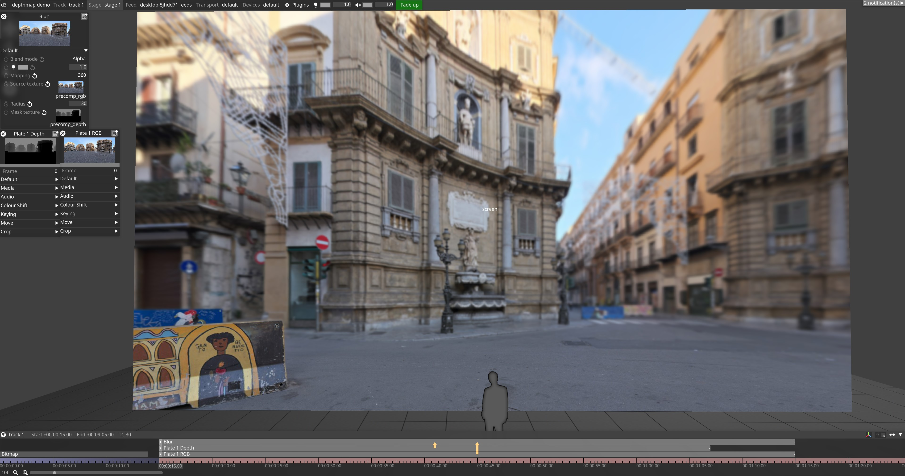
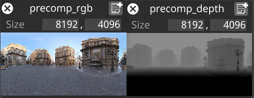
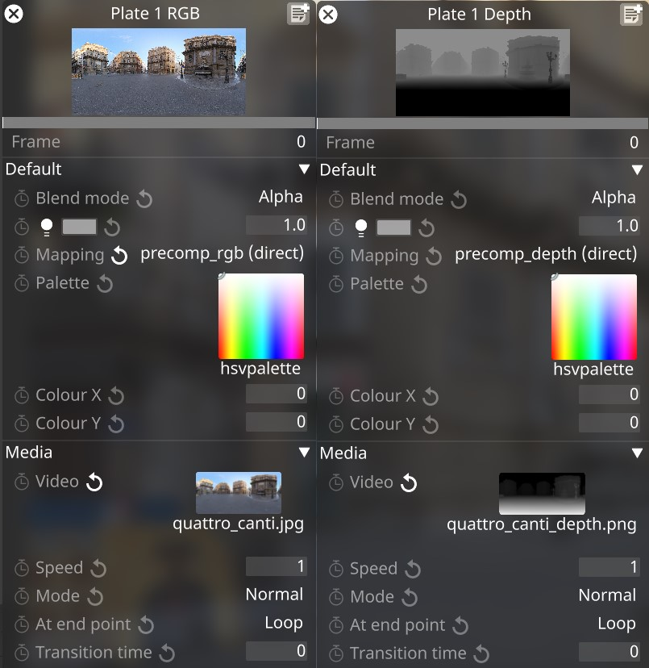
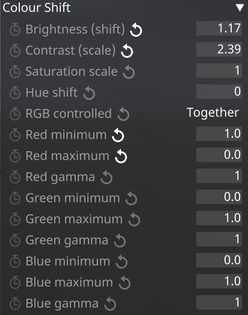
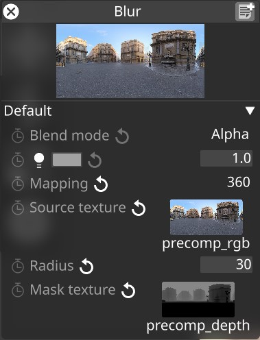

# **Applying Depth of Field using Blur Layer & Depth Map**

This guide provides the direct steps to set up depth-based blur on 2D content using a depth map and the Blur layer in Disguise Designer.

  

**Prerequisites:**

* RGB content (video/still) imported into Disguise.  
* Corresponding Depth Map content (video/still) imported into Disguise.

**Steps:**

1. **Create 2 Pre-Comp Textures: [PreComp Disguise UserGuide](https://help.disguise.one/designer/mapping/mapping-types/precomp)**  
   * Create a **Bitmap Layer**  
   * Open up the Media drop down, open the Texture window.  
   * Create a **PreCompTexture** (e.g. `precomp_rgb`).  
   * Set the **PreCompTexture** Size/Resolution to the Source content Resolution.  
   * Create a second **PreCompTexture** (e.g. `precomp_depth`).  
   * Set the **PreCompTexture** Size/Resolution to the Source content Resolution.  
   * You can now delete the **Bitmap Layer**

  

2. **Create Video Layers:**  
   * Add a **Video Layer** for your RGB content. Assign the RGB media.  
   * Set the Mapping to `precomp_rgb`  
   * Add a second **Video Layer** for your Depth Map content. Assign the Depth Map media.  
   * Set the Mapping to `precomp_depth`

  

3. **Configure Depth Map Layer:**  
   * Select the **Depth Map Video Layer**.  
   * Go to its **Colour Shift** settings.  
   * **Invert** the colours so close objects are black and far objects are white. Use RGB controls to invert.  
     * `RGB controlled: Together`  
     * `Red minimum 1.0`  
     * `Red maximum 0.0`  
   * **Adjust Brightness/Contrast** in the Colour settings to fine-tune the blur falloff.  
     * `Brightness (shift) - Controls the ‘distance’ of the blur`  
     * `Contrast (scale) - Controls the size of the min-max blur`  
   * **Fine-tuning** the brightness/contrast of the depth map is essential to achieve the desired look and requires artistic judgment.

  

4. **Apply and Configure Blur Layer:**  
   * Add a **Blur Layer** effect to your timeline.  
   * Creating Mapping (e.g., Direct, Spherical, etc.)  
   * Set `Source Texture` to `precomp_rgb`.  
   * Set `Mask Texture` to `precomp_depth`.  
   * Adjust the Blur Layer's `Radius` parameter to control the maximum blur for the ‘furthest’ elements.

  

**Result:** The RGB content will now have blur applied based on the depth map, with the amount controlled by the Blur Layer settings and the depth map's contrast/brightness adjustments.
